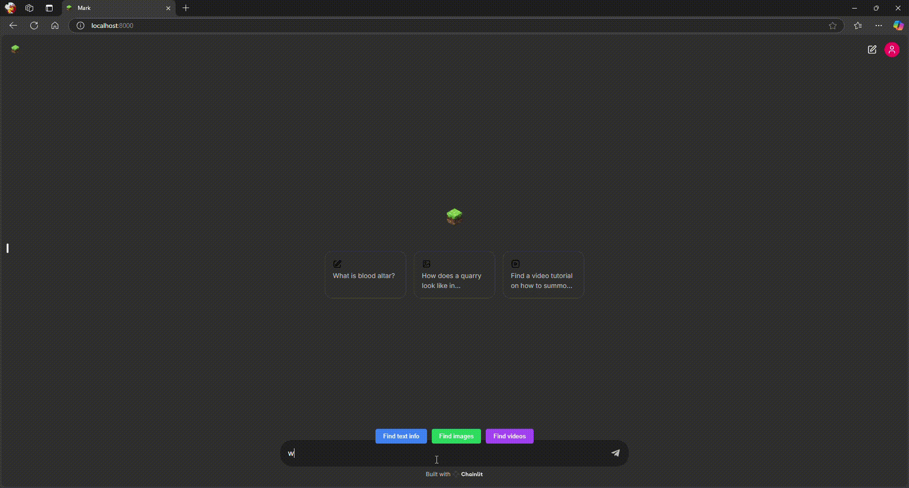

# Mark - Minecraft AI Advisor :globe_with_meridians:
RAG Agent with memory :speech_balloon:, that can perform web search without any external API's.

Based on [llama3-groq-tool-use](https://ollama.com/library/llama3-groq-tool-use) model, that can be ran locally, even on your laptop!

## Features
**Web search**: Users can explicitly note what kind of information thay want to find
- **Text based**
  <p align="center">
    
  </p>
- **Images**
  <p align="center">
    
  </p>
- **Videos**
  <p align="center">
    
  </p>
- **Memory**: Mark has ability to remember chat history, and use it to answer questions
  <p align="center">
    
  </p>

## Installation

1. Clone repo
```bash
git clone https://github.com/avtorgenii/minecraft-ai-advisor.git
```
2. Create venv and install dependencies
```bash
poetry install
```

## Run
To run **Mark** you need to:
1. Install [Ollama](https://ollama.com/download)
2. Pull [llama3-groq-tool-use](https://ollama.com/library/llama3-groq-tool-use) model
```bash
ollama pull ollama run llama3-groq-tool-use:8b
```
3. Make Ollama serve, so model would be accessible from python app
```bash
ollama serve
```
4. In project's root directory
```bash
chainlit run app/main.py
```
5. Enjoy :dizzy:

## Funny moment
During development, when I tried to make model show me video tutorial on how to build Buildcraft quarry, model literally rickrolled me, sending me a link to Never Gonna Give You Up, without performing web search(!!!) :dizzy_face:.

Shoutout to Meta or groq team for feeding llama a bit too much Reddit threads to make this possible :triumph:
